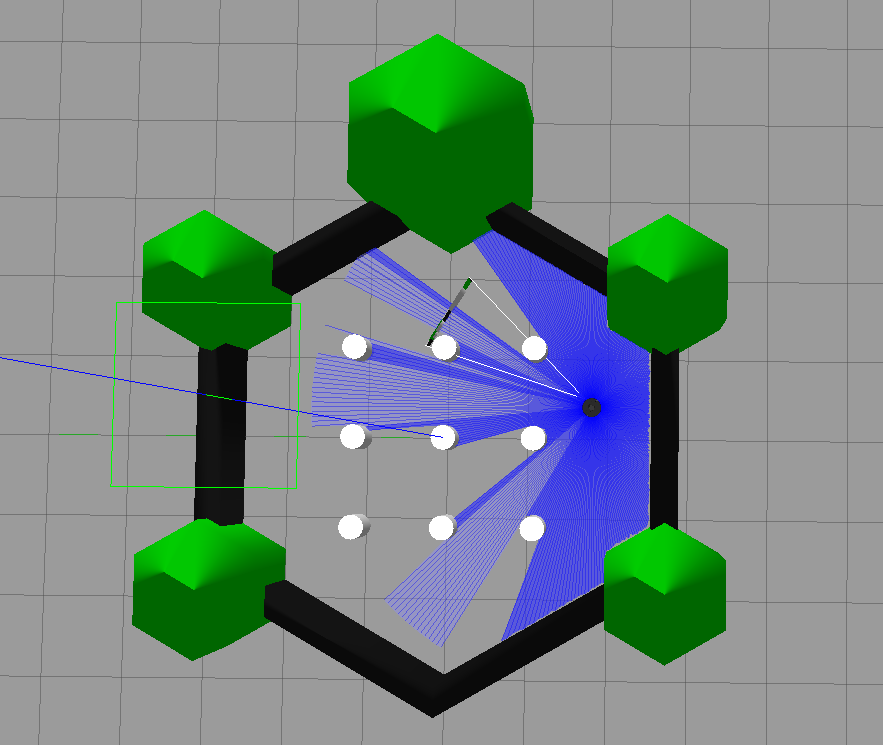

# Autonomous Nav2 Checkpoint Navigation (ROS 2 Humble)

An autonomous multi-checkpoint navigation project built for **TurtleBot3** using **ROS 2 Humble**, **Nav2**, and a custom-tuned **DWB controller**. The robot autonomously navigates through multiple checkpoints while dynamically computing goal orientations, detecting navigation stalls, and recovering from local planner failures.

---

## 🚀 Features

* **Dynamic Heading Vectoring**

  * Computes the desired robot heading in real time using `atan2()` based on the robot's current pose and target checkpoint.

* **Checkpoint Acceptance Bubble**

  * Clears checkpoints only when both conditions are satisfied:

    * Distance < **0.25 m**
    * Angular error < **±30°**

* **Stall Detection & Recovery**

  * Monitors robot movement over time.
  * Detects stalls when progress is less than **0.005 m**.
  * Automatically clears costmaps and cancels navigation tasks to recover from deadlocks.

* **Optimized Costmap Inflation**

  * Custom inflation parameters for improved navigation in narrow corridors.
  * Inflation radius: **0.22 m**
  * Cost scaling factor: **20.0**

---

## 📂 Repository Structure

```text
summer_siege/
├── custom_nav2_params.yaml        # Custom Nav2 and DWB parameters
└── src/
    └── autonomous_driver/
        ├── autonomous_driver/
        │   ├── __init__.py
        │   └── get_moving.py      # Main waypoint navigation node
        ├── package.xml
        └── setup.py
```

---

## 🛠 Prerequisites

* ROS 2 Humble
* Gazebo 11
* TurtleBot3
* Navigation2 (Nav2)

Install the required packages:

```bash
sudo apt update

sudo apt install \
    ros-humble-turtlebot3-gazebo \
    ros-humble-navigation2 \
    ros-humble-nav2-bringup
```

---

## ⚙️ Build

```bash
cd ~/summer_siege

colcon build --packages-select autonomous_driver

source install/setup.bash
```

---

## ▶️ Running the Simulation

### Terminal 1 — Launch TurtleBot3 Gazebo

```bash
export TURTLEBOT3_MODEL=waffle

source /opt/ros/humble/setup.bash

ros2 launch turtlebot3_gazebo turtlebot3_world.launch.py
```

---

### Terminal 2 — Launch Nav2

```bash
cd ~/summer_siege

source install/setup.bash

export TURTLEBOT3_MODEL=waffle

ros2 launch turtlebot3_navigation2 navigation2.launch.py \
    use_sim_time:=True \
    params_file:=./custom_nav2_params.yaml
```

---

### Terminal 3 — Run the Autonomous Driver

```bash
cd ~/summer_siege

source install/setup.bash

ros2 run autonomous_driver get_moving \
    --ros-args -p use_sim_time:=True
```

---

## ⚙️ Navigation Logic

The autonomous driver performs the following sequence:

1. Loads predefined checkpoints.
2. Computes the desired heading using `atan2()`.
3. Sends navigation goals to Nav2.
4. Monitors position and orientation errors.
5. Detects navigation stalls using micro-progress tracking.
6. Clears costmaps and retries navigation if recovery is required.
7. Continues until all checkpoints have been successfully reached.

---

## 📈 Controller Configuration

The project uses a custom-tuned Nav2 configuration including:

* DWB Local Planner
* Optimized inflation layer
* Reduced obstacle inflation
* Custom goal tolerance
* Recovery behaviors
* Costmap tuning for narrow environments

---

## 📸 Demo



---

## 📄 License

This project is released under the MIT License.
